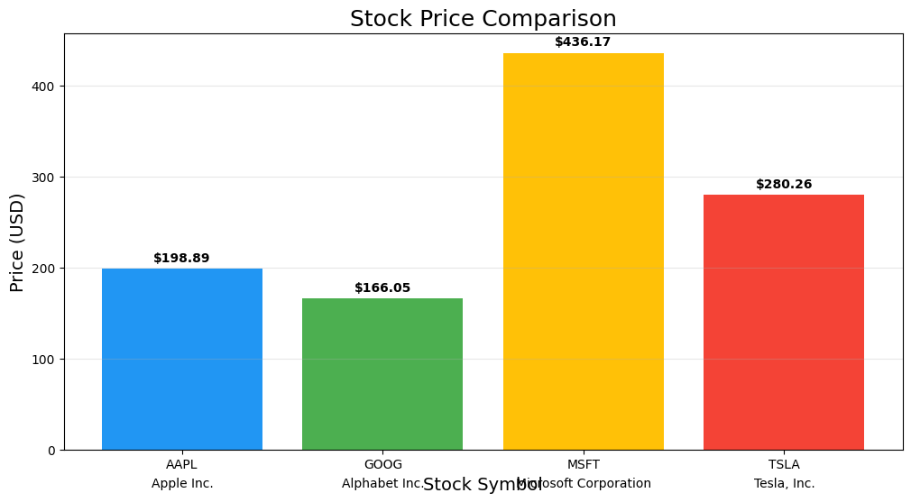
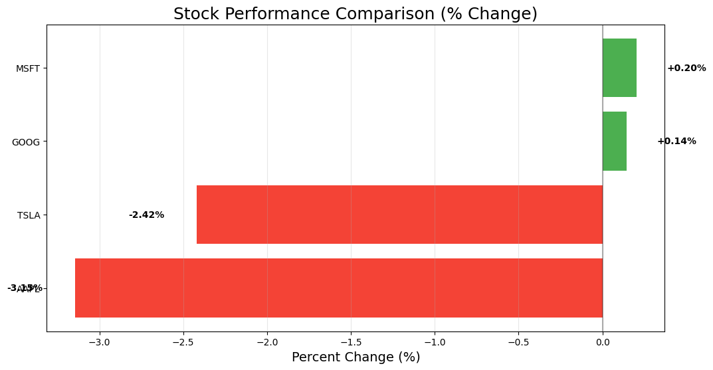
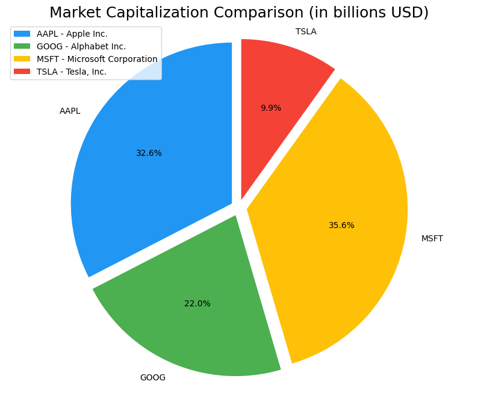

---

# 📊 Stock Data Visualization Project

A Python-based tool for fetching and visualizing real-time stock market data using the Yahoo Finance API (via RapidAPI). This application enables users to track and compare multiple stocks, offering insightful visualizations and easy configuration.

## 🚀 Features

* **Real-Time Data**: Fetches current stock data from Yahoo Finance via RapidAPI.
* **Multiple Stock Support**: Track and compare multiple stocks simultaneously (default: `AAPL`, `GOOG`, `MSFT`, `TSLA`).
* **Visualization Charts**:

  * 📈 Price Comparison (Bar Chart)
  * 📊 Performance Comparison (% Change - Horizontal Bar)
  * 🧩 Market Capitalization (Pie Chart)
* **Modular Architecture**:

  * API interaction
  * Data modeling
  * Logging
  * Visualization
* **Historical Storage**: Automatically saves stock data in JSON format for reference.
* **Command-Line Interface**: Simple and intuitive interface for data fetching and visualization.
* **Configurable**: Easily update tracked stocks via the configuration file.

## 🛠️ Tech Stack

* Python 3.8+
* [pandas](https://pandas.pydata.org/) - Data manipulation
* [matplotlib](https://matplotlib.org/) - Data visualization
* [numpy](https://numpy.org/) - Numerical operations
* [python-dotenv](https://pypi.org/project/python-dotenv/) - Environment variable management

## 📁 Project Structure

```
Data-Viz/
│
├── .env                    # Environment variables (API keys)
├── .gitignore              # Git ignore file
├── requirements.txt        # Dependencies
│
├── data/                   # Saved stock data
│   └── stock_data.json     # Latest stock data
│
├── charts/                 # Generated visualization charts
│   ├── price_comparison.png
│   ├── performance_comparison.png
│   └── market_cap_comparison.png
│
├── scripts/                # Executable scripts
│   └── fetch_stocks.py     # Main script to run
│
└── src/                    # Source code
    ├── api/
    │   └── yahoo_finance.py # API interaction
    ├── config/
    │   └── config.py       # Configuration settings
    ├── models/
    │   └── stock.py        # Stock data model
    ├── utils/
    │   └── logger.py       # Logging utilities
    └── visualization/
        └── charts.py       # Data visualization components
```

## ⚙️ Setup Instructions

1. **Clone the repository**

   ```bash
   git clone https://github.com/Ibrahimghali/Data-Viz.git
   cd Data-Viz
   ```

2. **Install dependencies**

   ```bash
   pip install -r requirements.txt
   ```

3. **Configure environment variables**

   * Create a `.env` file in the root directory:

     ```
     RAPIDAPI_KEY=your_api_key_here
     ```

4. **Update tracked stocks (optional)**

   * Edit the configuration file in `config/` to add or remove stock symbols.

5. **Run the application**

   ```bash
   python scripts/fetch_stocks.py
   ```

## 📷 Example Output

| Chart                     | Preview                                                      |
| ------------------------- | ------------------------------------------------------------ |
| 📈 Price Comparison       |              |
| 📊 Performance Comparison |  |
| 🧩 Market Capitalization  |    |

## 🛡️ Security

* API keys are stored in a `.env` file and are not tracked by version control.

## 📌 Notes

* Ensure your RapidAPI subscription allows access to the Yahoo Finance API.
* Network access is required to fetch the latest stock data.

## 📄 License

This project is licensed under the MIT License.

---
